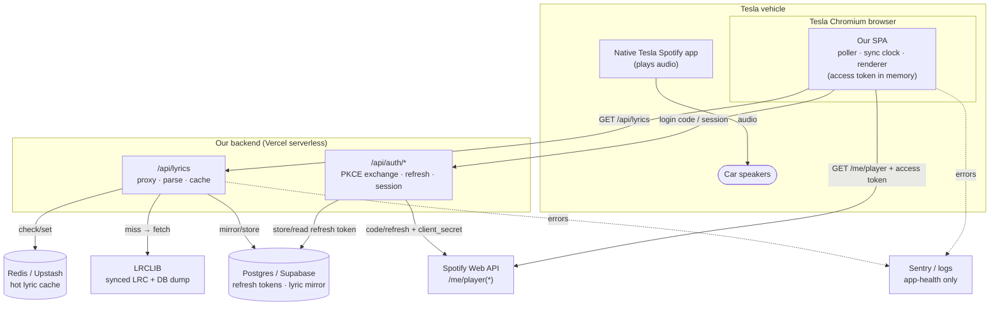
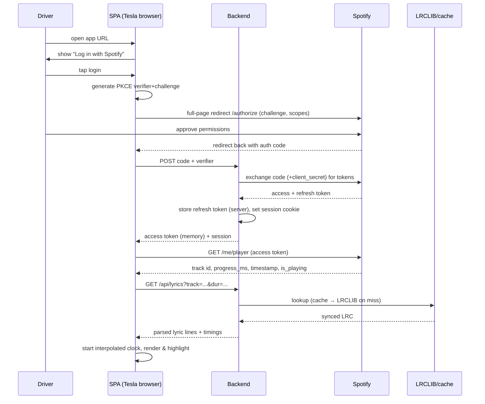
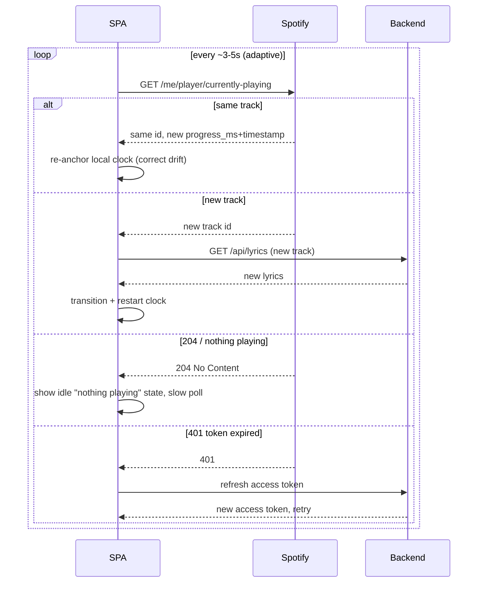

# 04 — Complete System Diagram

## 4.1 Component / data-flow overview (ASCII)

```
                        ┌───────────────────────────────────────────────┐
                        │                 TESLA VEHICLE                  │
                        │                                               │
   audio out  ◀─────────┤  Native Tesla Spotify app  ──── plays ──────┐ │
   (speakers)           │                                            │ │
                        │  ┌──────────────────────────────────────┐  │ │
                        │  │  Tesla Chromium browser               │  │ │
                        │  │  ┌────────────────────────────────┐   │  │ │
                        │  │  │  OUR SPA (React/Next, static)  │   │  │ │
                        │  │  │  • playback poller             │   │  │ │
                        │  │  │  • interpolated sync clock     │   │  │ │
                        │  │  │  • lyrics renderer (rAF)       │   │  │ │
                        │  │  │  access token in memory only   │   │  │ │
                        │  │  └───────┬───────────────┬────────┘   │  │ │
                        │  └──────────┼───────────────┼────────────┘  │ │
                        └─────────────┼───────────────┼───────────────┘ │
                                      │               │                 │
              (1) GET /me/player      │               │  (2) GET /api/lyrics
              with access token       │               │  (our origin)
                                      ▼               ▼
             ┌────────────────────────────┐   ┌──────────────────────────────┐
             │     SPOTIFY WEB API        │   │      OUR BACKEND (Vercel)     │
             │  /me/player                │   │  Next.js API routes:          │
             │  /me/player/currently-     │   │  • /api/auth/* (PKCE exch,    │
             │     playing                │   │     refresh, session)         │
             │  returns: track id, meta,  │   │  • /api/lyrics (proxy+cache)  │
             │  is_playing, progress_ms,  │   │  secrets: CLIENT_SECRET,      │
             │  timestamp                 │   │  refresh tokens (server-only) │
             └─────────────▲──────────────┘   └───┬───────────┬──────────┬────┘
                           │                      │           │          │
            (3) token exchange/refresh            │           │          │
            (client_secret, server→Spotify)       │           │          │
                           │             (4) lyric │   (5) hot │  (6) tok │
                           └──────────────────────┘   cache   │  store   │
                                                ▼              ▼          ▼
                                    ┌────────────────┐ ┌───────────┐ ┌──────────┐
                                    │   LRCLIB API   │ │  Redis    │ │ Postgres │
                                    │ (synced LRC)   │ │ (Upstash) │ │(Supabase)│
                                    │ + DB mirror    │ │ hot cache │ │ refresh  │
                                    └────────────────┘ └───────────┘ │ tokens + │
                                                                     │ lyric    │
                                                                     │ mirror   │
                                                                     └──────────┘

  Cross-cutting:  CDN edge (static SPA + cacheable lyrics)   •   Sentry (errors)   •   platform logs/analytics (app-health only)
```

## 4.2 Mermaid — component graph



## 4.3 Sequence — first login through first synced lyric



## 4.4 Sequence — steady-state polling & song change



## 4.5 Interaction inventory

Every arrow in the system, enumerated:

1. **Native Spotify → speakers** — audio. We do not touch this.
2. **SPA → Spotify Web API (GET)** — playback polling with the bearer access token; CORS-enabled GETs, so allowed directly from the browser.
3. **SPA → Backend `/api/auth/*`** — sends the PKCE auth code, receives a session + access token; later requests a refreshed access token.
4. **Backend → Spotify token endpoint** — server-side code exchange and refresh using the client secret. The only place the secret is used.
5. **SPA → Backend `/api/lyrics`** — same-origin lyric request keyed by normalized track signature.
6. **Backend → Redis** — read-through hot cache for parsed lyrics.
7. **Backend → LRCLIB** — cache-miss fetch; optionally served from a self-hosted DB mirror instead.
8. **Backend → Postgres** — store/read encrypted refresh tokens; optional lyric mirror.
9. **SPA/Backend → Sentry & logs** — error and app-health telemetry only (no listening data).
10. **CDN edge** — sits in front of static assets and cacheable lyric responses for latency.
