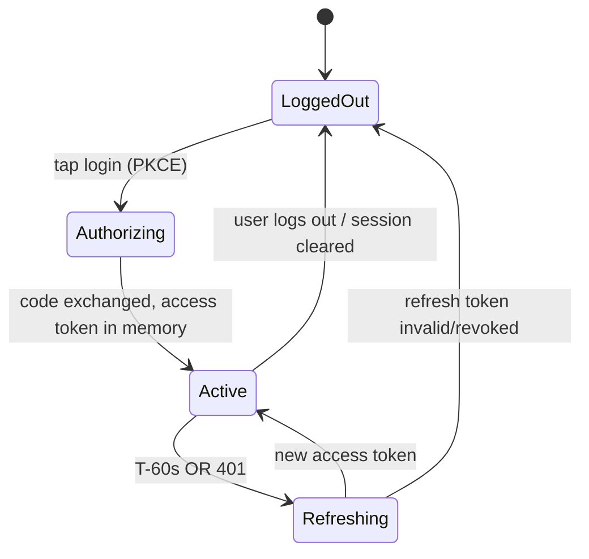

# 05 — Authentication Flow

## 5.1 Flow choice and why

Spotify offers a few OAuth flows; the landscape changed in late 2025 and we must design to the post-change rules:

- **Implicit Grant — ❌ removed.** Spotify removed implicit grant, plain-HTTP redirect URIs, and the `localhost` alias on **November 27, 2025**. We cannot use it.
- **Authorization Code (plain) — possible but needs a secret in the exchange.** Fine for the *server* side.
- **Authorization Code with PKCE — ✅ recommended.** This is Spotify's recommended flow for clients that can't safely hold a secret (SPAs). It adds a `code_verifier`/`code_challenge` so an intercepted authorization code is useless to an attacker.

We use **Authorization Code with PKCE**, with the **token exchange and refresh performed server-side** by our thin backend. PKCE protects the redirect; the backend protects the client secret and the refresh token. This hybrid is deliberately stricter than a pure client-side PKCE SPA, because the Tesla browser's storage is unreliable and we don't want long-lived refresh tokens sitting in it.

### Two variants (pick per threat model)

- **Variant A — "PKCE + server refresh" (recommended default).** Client does PKCE, sends the code to the backend, backend exchanges and keeps the **refresh** token server-side, returns the short-lived **access** token to the client (held in memory). Client polls Spotify directly. Simple, low-latency, secret never in browser.
- **Variant B — "Backend-for-Frontend (BFF)" (stricter).** The access token also never reaches the browser; the client calls *our* `/api/playback` which proxies to Spotify using the server-held token. Maximizes security (no token in the fragile browser at all) at the cost of an extra hop on every poll. Recommended if we ever go beyond personal use or want to fully neutralize token theft from the car.

The rest of this doc describes Variant A and notes where B differs.

## 5.2 Required scopes

| Scope | Why |
|-------|-----|
| `user-read-currently-playing` | Read the currently playing item. |
| `user-read-playback-state` | Read full playback state incl. `is_playing`, `progress_ms`, `timestamp`, device. |
| `user-modify-playback-state` | *Optional, later.* Only if we add pause/skip controls (see Feasibility #12). Not in MVP. |

We request the **minimum** scopes. Fewer scopes = less to justify on the consent screen and smaller blast radius if a token leaks.

## 5.3 Step-by-step (Variant A)

1. **PKCE setup (client).** Generate a high-entropy `code_verifier` (43–128 chars), derive `code_challenge = base64url(SHA256(verifier))`. Generate a random `state`. Keep `verifier` and `state` in memory (and a short-lived cookie as a fallback, since Tesla storage is flaky).
2. **Authorize (full-page redirect).** Navigate the whole page to `https://accounts.spotify.com/authorize` with `response_type=code`, `client_id`, `redirect_uri` (HTTPS, registered), `scope`, `state`, `code_challenge`, `code_challenge_method=S256`. **Full-page redirect, not a popup** — popups are `[UNCERTAIN]` in the Tesla browser.
3. **User consents** on Spotify's domain.
4. **Redirect back.** Spotify returns to our `redirect_uri` with `code` and `state`. Client verifies `state` matches (CSRF defense).
5. **Exchange (client → backend).** Client POSTs `{ code, code_verifier }` to `/api/auth/callback`. The backend POSTs to `https://accounts.spotify.com/api/token` with `grant_type=authorization_code`, the `code`, `redirect_uri`, `client_id`, `code_verifier`, **and the client secret** (server-side only).
6. **Store tokens (backend).** Spotify returns `access_token` (≈1 hour), `refresh_token` (long-lived, ~6 months), `expires_in`. Backend **encrypts and stores the refresh token** (Postgres, encrypted at rest), creates a server session, sets an **httpOnly, Secure, SameSite=Lax** session cookie.
7. **Return access token (backend → client).** Client receives the access token + an `expires_at`, holds it **in memory only**.
8. **Use it.** Client polls Spotify GET endpoints with `Authorization: Bearer <access_token>`.

## 5.4 Token lifecycle & refresh strategy

- **Access token:** lifetime ~3600s. Held **in memory** by the client (Variant A). Never written to `localStorage` (XSS + Tesla-persistence reasons).
- **Refresh token:** held **only on the server**, encrypted. PKCE refresh responses *may rotate the refresh token* — the backend must **persist the new one** each time (a classic gotcha).
- **Proactive refresh.** The client tracks `expires_at` and asks the backend for a fresh access token at ~T-60s, so a poll never fails mid-song due to expiry.
- **Reactive refresh.** If any Spotify call returns **401**, the client calls `/api/auth/refresh` once, gets a new access token, and retries the request. If refresh itself fails (refresh token revoked/expired), fall back to the login screen.
- **Refresh endpoint (backend):** `/api/auth/refresh` reads the session cookie → looks up the encrypted refresh token → calls Spotify `grant_type=refresh_token` → returns a new access token (and persists any rotated refresh token).

## 5.5 Session management

- **Server session** keyed by an opaque id in an **httpOnly, Secure, SameSite=Lax** cookie. The session maps to the user's encrypted refresh token.
- **Why server session + httpOnly cookie rather than storing tokens in the browser?** Because (a) the Tesla browser may wipe `localStorage` on reboot/crash, and a cookie-backed server session is more likely to survive, and (b) httpOnly cookies are not readable by JS, neutralizing token theft via XSS.
- **Session lifetime** is long (weeks) to minimize re-logins, but bounded; the refresh token's ~6-month life is the hard ceiling. If the session cookie is lost (Tesla wiped it), the user re-logs in — a single tap + Spotify's remembered consent makes this quick.

## 5.6 Security specifics (summary; full treatment in [Security](11-security.md))

- **PKCE (S256)** on every authorize — protects the code in transit/redirect.
- **`state` parameter** validated on return — CSRF defense for the OAuth callback.
- **Client secret** only ever on the server, injected via environment/secret manager, never bundled.
- **HTTPS everywhere** — mandatory anyway: Spotify now rejects non-HTTPS redirect URIs.
- **Access token in memory only**; refresh token server-side, encrypted at rest.
- **httpOnly/Secure/SameSite cookies** for the session.
- **Redirect URI allow-list** registered in the Spotify dashboard (exact match); since `localhost` is banned, local dev uses `http://127.0.0.1`.
- **Variant B** removes the access token from the browser entirely for maximum hardening.

## 5.7 Tesla-specific auth gotchas

- **No popup OAuth.** Use full-page redirect; verify on hardware that the round-trip completes `[UNCERTAIN]`.
- **Storage may not persist.** Don't rely on `localStorage` for the verifier/state across the redirect if a reboot could intervene; a short-lived httpOnly cookie set before redirect is the safer carrier. Expect occasional forced re-login and make it one tap.
- **Minimize typing.** The only keyboard moment is the Spotify password on Spotify's page; consider that Spotify may remember the login, so subsequent re-auths can be tap-only.
