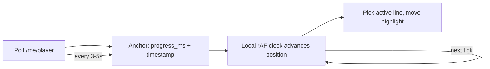

# 06 — Spotify Integration

## 6.1 Endpoints we actually use

| Endpoint | Method | Scope | Purpose |
|----------|--------|-------|---------|
| `/authorize` | redirect | — | Start OAuth (PKCE). |
| `/api/token` | POST | — | Exchange code / refresh (server-side). |
| `/me/player` | GET | `user-read-playback-state` | **Primary poll.** Full playback state: device, `is_playing`, `progress_ms`, `timestamp`, `item` (track), `currently_playing_type`, `actions`. |
| `/me/player/currently-playing` | GET | `user-read-currently-playing` | Lighter poll: just the current item + progress. Use when we don't need device info. |
| `/me/player/pause`, `/next`, `/previous` | PUT/POST | `user-modify-playback-state` | **Optional, post-MVP** transport controls (Feasibility #12). |

We do **not** use any of the endpoints deprecated in Nov 2024 / Feb 2026 (audio-features, recommendations, related-artists, top-tracks, etc.) — none are relevant, and all the player endpoints we need explicitly **survived** both purges.

### Key response fields for sync

From `/me/player`:

- `item.id` — track id; **the song-change signal.**
- `item.name`, `item.artists[].name`, `item.album.name`, `item.album.images[]`, `item.duration_ms` — display + lyric matching.
- `item.external_ids.isrc` — ISRC (removal was reverted Mar 2026; useful as a precise match key when present).
- `is_playing` — pause/resume signal.
- `progress_ms` — position into the track. **The sync anchor.**
- `timestamp` — Unix **ms** of when state last changed. Used for latency correction (below).
- `currently_playing_type` — `track` / `episode` / `ad` / `unknown`. We only do lyrics for `track`.
- Returns **`204 No Content`** when nothing is playing / no active device → treat as "idle."

## 6.2 The sync model: poll + interpolate

The core trick: **don't poll fast, poll occasionally and run a local clock between polls.**

When a poll returns at wall-clock time `T_recv` with `progress_ms` and `timestamp`, the *true* current position (accounting for the time the request spent in flight) is approximately:

```
estimatedPosition(now) =
    progress_ms
  + (now - timestamp)          // time elapsed since Spotify captured the state
  // (only while is_playing === true; frozen when paused)
```

Using `timestamp` (Spotify's own capture time) instead of `T_recv` corrects for network latency and is the reason sync feels tight despite a slow poll. Between polls, a `requestAnimationFrame` loop advances `estimatedPosition` by real elapsed time, and the renderer picks the active lyric line whose timestamp bracket contains it. Each new poll **re-anchors** the clock, silently correcting any drift (e.g. from a user scrubbing, or clock skew).



## 6.3 Polling strategy (adaptive)

Spotify publishes **no** official poll interval and **no** exact rate-limit number; limits are computed over a **rolling 30-second window** and a 429 returns a `Retry-After` header. For a *single user*, generous polling is safe; we still poll politely and adaptively:

| State | Interval | Rationale |
|-------|----------|-----------|
| Steady playback, mid-song | **5 s** | Drift between polls is corrected by interpolation; 5s is plenty. |
| Approaching end of track (last ~10 s) | **2 s** | Tighten so the song-change swap feels instant. |
| Just detected a possible change / 204→playing transition | **1 s burst (a few times)** | Catch the new track id quickly, then relax. |
| Paused | **10–15 s** | Nothing moving; just watch for resume. |
| Idle (204, nothing playing) | **15–30 s** | Don't waste calls; watch for playback to start. |
| Tab hidden / app backgrounded | **pause polling** | Resume on visibility. (Tesla browser focus behavior is `[UNCERTAIN]` — also guard with a max-age check on resume.) |

This keeps a single user comfortably within any plausible rate limit while feeling responsive. **Variant B (BFF)** centralizes polling on the server, where we can additionally de-duplicate and coalesce.

## 6.4 Detecting events

- **Song change:** `item.id` differs from the last known id → fetch new lyrics, transition the UI, restart the clock from the new `progress_ms`. (Edge: same id but huge `progress_ms` jump → user scrubbed → just re-anchor, keep lyrics.)
- **Pause:** `is_playing` flips `true → false` → freeze the local clock at current position; stop advancing the highlight.
- **Resume:** `false → true` → re-anchor from the fresh `progress_ms`/`timestamp` and resume advancing.
- **Scrub/seek:** same `item.id`, `progress_ms` jumps beyond what interpolation predicts → snap the highlight to the new position.
- **Ad:** `currently_playing_type === 'ad'` → show an "ad playing" idle state, no lyrics, slow poll until it returns to `track`.
- **Episode (podcast):** `currently_playing_type === 'episode'` → no lyrics; show now-playing only. (We don't request `additional_types=episode` unless we want to display podcast metadata.)
- **Nothing playing / device closed:** `204` → idle state.

## 6.5 Error recovery

| Condition | Handling |
|-----------|----------|
| **401 Unauthorized** | Access token expired/invalid → refresh once via backend, retry. If refresh fails → login screen. |
| **403 Forbidden** | Often a scope/quota/region issue. Surface a clear message; log. For a non-allow-listed user in dev mode, this is expected → explain the 5-user cap. |
| **429 Too Many Requests** | Read `Retry-After`, **stop polling for that many seconds**, then resume with a longer interval (exponential backoff with a cap). Never tight-loop on 429. |
| **204 No Content** | Idle state; slow poll. Not an error. |
| **5xx / network error** | Exponential backoff with jitter (e.g. 2s, 4s, 8s, cap 30s). Keep showing the last known lyrics frozen with a subtle "reconnecting" hint rather than blanking the screen. |
| **Tesla browser stalls/sleeps** | On `visibilitychange`/resume, immediately do one poll and re-anchor; if `now - timestamp` is large, treat as stale and re-fetch. |
| **Clock skew** (device clock wrong) | Because we anchor on Spotify's `timestamp` and add `(now - timestamp)`, a wrong *local* clock biases the estimate; mitigate by re-anchoring frequently and, optionally, computing an offset between server time and device time at login. |

## 6.6 ToS guardrails baked into the integration

- We display **cover art + metadata** alongside lyrics — not only good UX but **required** by Spotify's attribution policy when showing their content.
- We **attribute to Spotify** (logo/mark, "playing on Spotify") and link now-playing back to the track on Spotify, per policy §II.4.
- We **do not** derive or store listening analytics/user profiles (policy §III.13) — the playback data is used transiently to drive the UI, not logged per-user.
- We do **not** train any model on Spotify data (policy §III.14).
- We acknowledge in [Risks](15-risks.md) that *synchronizing* lyrics to playback is in tension with §III.6; the personal, non-commercial, 5-user posture is the mitigation.
