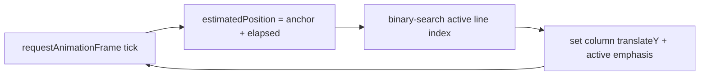

# 09 — Performance

The performance brief is unusual: the *server* load is trivial (≤5 users), but the *client* runs in an old, memory-pressured, possibly-crash-prone Chromium on automotive hardware. So this section is 80% about client rendering and 20% about API/network economics.

## 9.1 Latency budget

| Hop | Typical latency | Notes |
|-----|-----------------|-------|
| Tesla LTE/5G → Spotify GET `/me/player` | ~150–500 ms | Cellular; varies with signal. Corrected for via `timestamp`. |
| Tesla → our backend `/api/lyrics` (cache hit) | ~50–200 ms | CDN/edge close to car; cache hit is fast. |
| Backend → LRCLIB (cache miss) | ~200–800 ms | One-time per song, then cached. |
| Token refresh (backend ↔ Spotify) | ~200–500 ms | Proactive at T-60s so it's never on the critical path. |

**Why latency barely matters for sync:** we anchor on Spotify's `timestamp` (when *it* captured the state) and add real elapsed time, so a 400ms request delay does **not** desync the highlight — the math accounts for it. Latency only affects how quickly we *notice* a song change, which the adaptive polling (tighter near track end) handles.

## 9.2 Polling & bandwidth

- **Steady state: 1 small GET every ~5s** (often a 204 or a few KB of JSON). Tighten to 2s near track end, burst to 1s on suspected change, relax to 15–30s when idle/paused. (See [Spotify Integration](06-spotify-integration.md).)
- **Lyrics: one fetch per song**, cached thereafter (shared across users). A typical parsed `LyricsDoc` is a few KB.
- **Estimated bandwidth for a 3-hour session:** playback polls ≈ (mostly 2–4 KB each, ~720 polls) ≈ **2–3 MB**, plus a handful of lyric fetches (≈ tens of KB total) and the initial app load (~a few hundred KB gzipped, then CDN-cached). **Well under ~5 MB/hour** — negligible for an in-car connection, and friendly to metered LTE.
- **Single-user rate-limit headroom:** at 1 call / 5s = 12/min, we're far under any plausible Spotify limit (rolling 30s window). We still honor `Retry-After` on 429 defensively.

## 9.3 Smooth lyric scrolling — the core rendering problem

Goal: **60fps, perfectly smooth glide** on an old Chromium with limited RAM/CPU. The approach:

1. **Render a small window, not the whole song.** Only ~7–9 lines are in the DOM at once (the active line plus a few of context each way). A 60-line song never puts 60 nodes on screen. This keeps the DOM tiny → less memory, faster layout.
2. **Animate `transform: translateY()`, never `top`/`margin`/scroll-offset.** Transforms are GPU-composited and skip layout/paint; animating layout properties would thrash the old browser. Set `will-change: transform` on the lyric column so the compositor promotes it to its own layer.
3. **Drive position from a `requestAnimationFrame` clock**, not CSS keyframe animations or `setInterval`. Each frame: compute `estimatedPosition`, binary-search the active line index, set the column's `translateY` (and the active line's emphasis). This is a few math ops + one style write per frame — trivially 60fps-capable.
4. **Decouple "which line is active" from "where the column is."** The highlight (brightness/scale) and the scroll (translateY) are both pure functions of `estimatedPosition`, so there's no state to drift.
5. **Ease between lines** with interpolation in the rAF loop (the column position is continuous, not snapped per line), giving the gliding feel without a JS animation library.
6. **Avoid per-frame allocations** (no new objects/arrays in the rAF callback) to prevent GC pauses that show as jank on constrained hardware.

## 9.4 Memory management (the Tesla-specific risk)

Owners report the Tesla browser **crashing under memory pressure** on heavy/constantly-updating pages. Mitigations:

- **Tiny, stable DOM** (windowed rendering above) — the node count doesn't grow with song length or session length.
- **No memory leaks in the poll/rAF loops:** reuse objects, clear timers on unmount, cancel rAF on pause/hide, and never accumulate per-poll history beyond the last anchor.
- **Bounded caches client-side:** keep only the *current* song's parsed lyrics in memory (plus maybe a one-song lookahead). Don't hoard every song played this session.
- **No service-worker/IndexedDB growth** (we don't rely on them anyway).
- **Periodic self-check:** if the page detects it's been alive a very long time and memory APIs (where available) show pressure, it can gracefully soft-reset its view state. (`performance.memory` is non-standard and may be absent — best-effort only.)
- **Lightweight assets:** small JS bundle (conservative transpile target), system fonts, compressed images (album art is small and comes from Spotify's CDN).

## 9.5 Rendering performance checklist

- One composited layer for the lyric column; avoid creating dozens of layers.
- No box-shadows/filters animated per frame (expensive paint on old GPUs); emphasis via opacity/transform/scale only.
- Cross-fade song transitions with opacity, capped duration (~300–400ms).
- Throttle/disable animations when the tab is hidden; resume cleanly on visibility.
- Test specifically on the **oldest plausible Chromium** target, not just current Chrome — what's smooth on a 2025 desktop may stutter on the car. `[verify on hardware]`

## 9.6 Backend/cache performance

- **Lyrics cache hit path** is the hot path: Redis (Upstash) lookup by `trackKey` → return parsed doc. Sub-100ms typical; popular songs never re-hit LRCLIB.
- **Negative cache** prevents repeated LRCLIB calls for songs with no lyrics.
- **Token refresh** is proactive and off the critical path.
- **Cold-start:** serverless functions can cold-start; at hobby scale this is occasional and acceptable, and the lyrics CDN cache + client retry hide it. If it ever matters, move the lyrics proxy to an always-warm edge function (Cloudflare Workers).

## 9.7 What "perfectly smooth" depends on, honestly

Smoothness is achievable, but two things are `[UNCERTAIN]` until tested on a real car: (1) the actual Chromium version's compositor behavior, and (2) whether long sessions trigger the memory-crash behavior owners describe. The design minimizes both risks (tiny DOM, transform-only animation, bounded memory), but **on-hardware testing is a required milestone** before claiming the smooth-scroll goal is met (see [Roadmap](13-development-roadmap.md), Phase 5).
