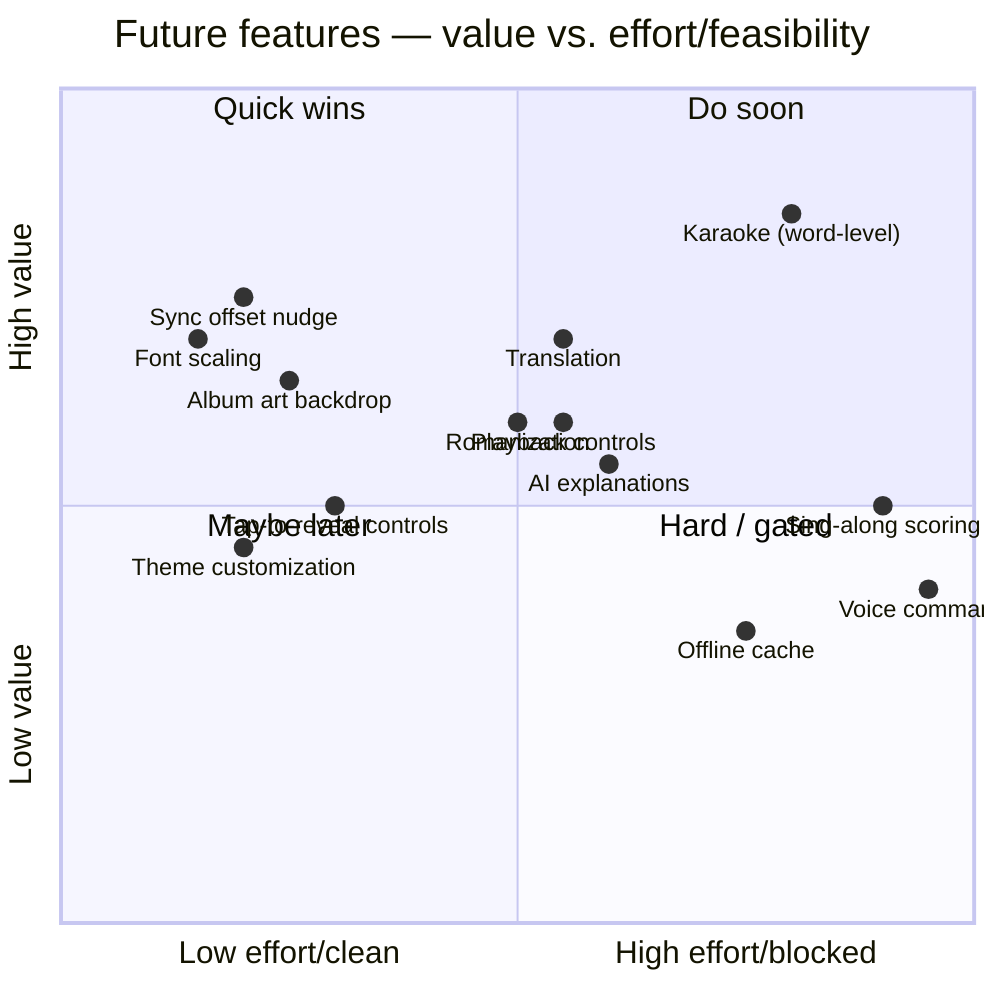

# 16 — Future Features

Each candidate gets a feasibility verdict (✅ / ⚠️ / ❌) with the specific blocker or enabler, so the roadmap is honest about what's actually attainable given Tesla + Spotify + lyrics-licensing constraints.

| Feature | Verdict | Notes |
|---------|---------|-------|
| **Karaoke / word-by-word highlight** | ⚠️ licensed-only | Requires word-level timing. LRCLIB is line-level only; word-level needs **Musixmatch Richsync** or **Apple TTML** — both gated/licensed. Buildable *only* with a paid licensed provider. The rendering (per-word emphasis on the active line) is easy; the *data* is the gate. |
| **Translation of lyrics** | ⚠️ | Technically easy (translate each line via a translation API and show original + translation). But: (a) translation API cost, (b) derivative-work/licensing questions for displaying translated copyrighted lyrics, (c) keeping translation aligned to timing. Fine for personal use; licensing-sensitive commercially. |
| **Romanized lyrics** (e.g. Japanese/Korean/Cyrillic → Latin) | ⚠️ | Romanization libraries exist; quality varies by script. Same licensing caveat as translation (it's a derivative). Good personal-use feature; do it client-side or in the proxy. |
| **Font scaling control** | ✅ | Pure client UI. A simple A−/A+ control adjusting the `clamp()` base. Trivial and high-value for varied eyesight/seating. |
| **Gesture controls** (swipe to skip, tap zones) | ⚠️ | Swipe/tap gestures are easy in-browser; mapping "skip" to actually skipping requires `user-modify-playback-state` (control endpoints) against the active device — works, adds ToS surface and a scope. Tap-to-reveal-controls is ✅; swipe-to-skip is ⚠️. |
| **Album artwork display / ambient backdrop** | ✅ | Art comes from the Spotify track object and is **already required** by attribution policy. A blurred-art ambient background behind the lyrics is a cheap, premium-feeling touch (watch GPU cost on old hardware). |
| **Queue display** | ❌→⚠️ | `GET /me/player/queue` exists but is less reliable and may be affected by API restrictions; not core to a lyrics app. Low priority; verify endpoint availability before promising. |
| **Playback controls (play/pause/skip/volume)** | ⚠️ | Web API control endpoints work with `user-modify-playback-state` against the active (native) device. Feasible as a later nicety; adds scope + ToS surface. Volume control of the car is **not** ours — only the Spotify player's. |
| **Theme customization** | ✅ | Client-only (dark variants, accent, art-driven palette). Easy; just keep night-default and contrast safe. |
| **Offline lyric cache** | ❌→⚠️ | Durable offline needs service workers/IndexedDB, which are **unreliable in the Tesla browser**. In-session memory cache works; true offline does not. If targeting non-Tesla browsers too, a PWA cache becomes ✅ there. |
| **AI lyric explanations / "what does this mean?"** | ✅ (tech) / ⚠️ (cost+rights) | Send the lyric (or song) to an LLM for annotation on demand. Technically straightforward; costs per call; and note **Spotify §III.14 forbids training models on Spotify data** (using an existing model for explanation ≠ training, but be careful), plus lyrics-copyright when sending full text to a third party. On-demand, personal use is defensible. |
| **Real-time translation** (live, as it scrolls) | ⚠️ | Combination of translation + word/line timing; cost and latency grow. Pre-translate the whole song on load rather than per-line live to keep it smooth. Licensing caveat as above. |
| **Sing-along scoring** (mic listens, scores you) | ❌ in Tesla / ⚠️ elsewhere | Needs microphone access. The Tesla browser's mic availability is unconfirmed/unlikely, and pitch/lyric scoring is a big build. Not realistic in-car; possible on phone/desktop builds. |
| **Voice commands** | ❌ in browser | No reliable in-car web speech path; Tesla's own voice system isn't exposed to web apps. Not feasible from our app. |
| **Manual sync offset nudge** (±) | ✅ | Small control to shift timing when an LRC is slightly off. Cheap, fixes the most common annoyance with crowdsourced lyrics. |
| **Contribute-lyrics flow** | ⚠️ | LRCLIB accepts anonymous contributions (`POST /api/publish`). Could let users add/fix lyrics. Nice for the ecosystem; keep it out of the driving-distraction path (parked only) and minimal-typing. |
| **Multi-provider fallback** (LRCLIB → NetEase/Megalobiz) | ⚠️ | Improves coverage via the provider abstraction; inherits each source's gray-area status. Personal-use only. |
| **Cross-device handoff / phone companion** | ✅ | Same web app works on a phone/desktop; since `/me/player` follows the active device, the experience is consistent across devices. |
| **"Now playing" history / stats** | ❌ (policy) | Spotify §III.13 forbids deriving listenership analytics/profiles. Don't build user listening stats from Spotify data. |

## Prioritization view

## The honest near-term list

If this stays a personal LRCLIB-based tool, the realistically buildable, high-value, low-risk additions are: **font scaling, manual sync-offset nudge, album-art ambient backdrop, theme options, tap-to-reveal playback controls, and romanization/translation for personal use.** Everything genuinely premium (word-level karaoke especially) waits on a *licensed* lyrics provider — which in turn waits on the commercial/legal questions in [Risks](15-risks.md).
